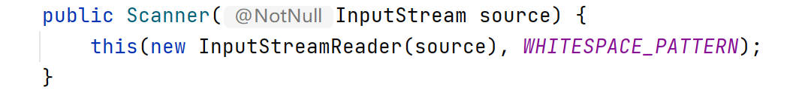
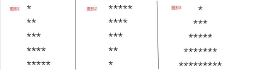
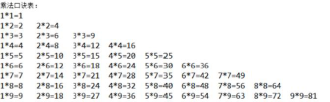

# 一、输入输出

定义扫描器`Sacnner`。



源码在此，需要构造一个`InputStream`类型数据，即`System.in`。

详见[BasicalInput](../06-basical-input/src/sample/java/BasicalInput.java)

# 二、if分支

基础，代码结构如下。
```java
if (statements) {
    block;
} else if (statements) {
    block;
} else {
    block;
}
```

# 三、switch-case语句

基础，代码结构如下。
```java
switch(expression){
        case value :
        block;
        break; 
        case value :
        block;
        break;
default : 
        block;
}
```
有种言论说switch-case比if-else效率高？但我还是习惯if-else，大部分人也是习惯if-else。

# 四、while循环

## 4.1 while

基础，代码结构如下。
```java
while(statements){
    block;
}
```

## 4.2 do-while循环

基础，但我没怎么用过，代码结构如下。

先运行一次do，在执行while循环。
```java
do{
    block
} while (statements);
```

# 五、for循环

## 5.1 基础for循环

太基础了，一切程序的核心就是循环。
```java
for(init; statements; update) {
    block;
}
```

## 5.2 增强for循环

也称For-Each循环。

遍历Object用到的较多，在**无法**或**比较困难**描述变量内容或索引时，用这个。

比如索引内容不定的时候也有用到，比如[深拷贝问题](https://blog.csdn.net/sinat_38332832/article/details/112748972)
```java
for(declare var : vars)
{
   block;
}
```

# 六、break和continue

## 6.1 break

用于中断或提前结束循环。

## 6.2 continue

用于跳过当前的block，进入下一层循环。

我不怎么用，好像也不推荐多用。

# 七、图像打印

刚学c语言把我按在地上摩擦的题
[打印沙漏](https://blog.csdn.net/sinat_38332832/article/details/115249877)

可能这辈子再也不会爱循环打印了。

# 九、Homework

三个支线

## 9.1 选择结构训练任务

1、某市出租车，起步价（2 公里以内）为 8 元，超过 2 公里的按照每公里 4.5 元计算。要求根据路程计
算费用。

[CabFee](../07-homework2-1/src/sample/java/CabFee.java)

2、输入年份，判断输入的年份是否是闰年。（闰年的条件是能被 4 整除，但不能被 100 整除；或能被
400 整除。）

[IsLeapYear](../07-homework2-1/src/sample/java/IsLeapYear.java)

3、要求输入月份，判断该月所处的季节并输出季节（假设：12、1、2 月为冬季，依次类推）

[JudgeSeason](../07-homework2-1/src/sample/java/JudgeSeason.java)

4、根据《国家电网销售电价表》，居民生活用电按 3 个梯度收费：月用电量 150 千瓦时及以下部分，
每千瓦时 0.43 元，151—400 千瓦时部分为 0.45 元，401 千瓦时以上部分为 0.52 元，请编写程序，当输入
用户的用电量时，计算出所需付的费用。

[StepTariff](../07-homework2-1/src/sample/java/StepTariff.java)

> 解析：都是简单的if语句，但层层嵌套容易混乱，俗称金字塔。
   > 
> 要是出bug了，加层if就完事了。

```java
// 这就是金字塔
if (true) {
    if (true) {
        if (true) {
            if (true) {
                if (true) {
                    if (true) {
                        
                    }
                }
            }
        }
    }
}
```

## 9.2 人工智障训练任务

完成人工智障系统，并添加合适注释。

[人工智障](../08-homework2-2/src/sample/java/AI.java)

## 9.3 流程控制的逻辑训练任务(分支+循环综合)

学习完毕分支与循环，很有必要锻炼一下大家的逻辑能力。所以本节任务
主要涉及了几个逻辑题，请一一完成。

1、[计算应缴金额](../09-homework2-3/src/sample/java/CalDiscount.java)

商场根据会员积分打折：
2000 分以内打 9 折，
4000 分以内打 8 折，
8000 分以内打 7.5 折，
8000 分以上打 7 折，使用 if-else-if 结构，实现手动输入购物金额和积分，
计算出应缴金额

2、[计算该年该月天数](../09-homework2-3/src/sample/java/CalDate.java)

一年中有 12 个月，而每个月的天数是不一样的。其中大月 31 天，分别为
1,3,5,7,8,10,12 月，小月 30 天，分别 为 4,6,9,11 月。还有二月比较特殊，平
年的二月只有 28 天，而闰年的二月有 29 天，由用户在控制台输入年份和月份，
程序计算该年该月的天数。

> 加上判断闰年就行
> 
> 这题的进阶版就是算两个日期的天数差，可以直接调库也可以用模拟法。

3、[图形打印任务](../09-homework2-3/src/sample/java/GraphPrinter.java)

在控制台中，编写三个 Demo，分别输出如下图形：



4、[打印九九乘法表](../09-homework2-3/src/sample/java/MultiplicationTable.java) ，效果如图：



5、打印三位数中的所有[水仙花数](../09-homework2-3/src/sample/java/NarcissisticNumber.java)

所谓“水仙花数”即一个整数满足其值等于各个数位的立方和。
如: 153 是一个水仙花数，因为 153= 1³+5³+3³

