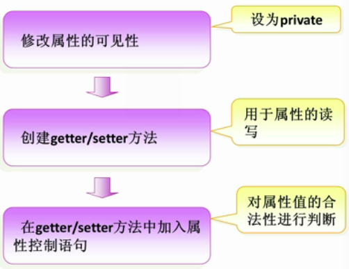
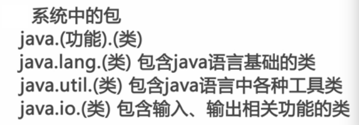

# 一、面向对象概述

面向对象(Object Oriented)是软件开发方法。面向对象的概念和应用已超越了程序设计和软件开发，是一种对现
实世界理解和抽象的方法，是计算机编程技术发展到一定阶段后的产物。

面向对象是相对于面向过程来讲的，指的是把 相关的数据和方法组织为一个**整体**来看待，
从更高的层次来进行系统建模，更贴近事物的自然运行模式。

面向过程到面向对象思想层面的转变：

1. 面向过程关注的是执行的过程，面向对象关注的是具备功能的对象。

2. 面向过程到面向对象，是程序员思想上 从执行者到指挥者的转变。

## 1.1 面向对象编程都有什么

### 1.1.1 对象

实例化后的类。

创建对象的语法如下：

```java
类名 对象名 = new 类名();
```

在使用类的时候，一定要注意作用域，作用域可以简单地理解为变量的生存期或者作用范围，
也就是变量从定义开始到什么时候消亡。
1. 局部变量的作用域仅限于定义它的方法内。而成员变量的作用域在整个类内部都是可见的。
2. 同时在相同的方法中，不能有同名的局部变量；在不同的方法中，可以有同名的局部变量。
3. 成员变量和局部变量同名时，局部变量具有更高的优先级。 大家可以编写代码验证一下。

### 1.1.2 类

类中含有类的属性及方法

**类的定义**：

1. 类是相同或相似对象的一种抽象，是对象的一个模板，它描述一类对象的行为和状态。
2. 类是具有相同属性和方法（行为）的对象的集合

### 1.1.3 属性

类中的成员变量，要与一般变量能区分开。

一个类可以包含以下类型变量：

1. 局部变量：在方法、构造方法或者语句块中定义的变量被称为局部变量。变量声明和初始化都是在方法中，
   方法结束后，变量就会自动销毁。
2. 成员变量：成员变量是定义在类中，方法体之外的变量。这种变量在创建对象的时候实例化。
   成员变量可以被类中方法、构造方法和特定类的语句块访问。
3. 类变量：也叫静态变量，类变量也声明在类中，方法体之外，但必须声明为 static 类型。

### 1.1.4 方法

存在在类中的面向过程函数（可以这么理解，但不是这么说的）。

可以定义一个方法或多个方法，当然也可以不定义方法。

### 1.1.5 匿名对象

若这个对象中的方法只使用一次，那么可以用匿名对象的方式去调用这个对象。

即不创建对象，直接使用。

```java
new ClassName().function(...);
```

## 1.2 堆栈

### 1.2.1 栈

栈（Stack）：Java中一个线程就有一个栈区，每一个栈中的元素都是私有的，不被其他线程所访问，
栈都有先进后出的特点，栈中的数据大小与生存期都是确定的，缺乏灵活性，但存取速度比堆快，仅次于寄存器。

栈存储速度快的原因：

1. 栈内存，通过栈指针来创建空间与释放空间
2. 指针向下移动，会创建新的内存，向上则会释放这些内存
3. 这种移动的方式，必须要明确移动大小与范围
4. 存储数据量小

### 1.2.2 堆

堆（Heap）：存放的是对象的类。

Java中每new一个对象，就会告诉JVM去开辟一个新的堆内存空间。

堆的优点是，不必关注堆内存中开辟多少空间，也不需要关注内存占用时长。

堆内存中的内存释放是由GC（垃圾回收器）完成的。

### 1.2.3 总结

其实和C++指针原理类似，只不过没有解引用运算符、指针运算符罢了。

与Python更加相似！

无非就是变量名全部是以指针的形式存在，在调用赋值的时候自动解引用。

# 二、Java面向对象编程

类必须编写在.java文件中。

一个.java文件可以存在多个类，但只能存在一个public修饰的类。且必须与文件名完全一致。

要与接口区分开。

### 2.1 类的定义

定义一个类，主要有三个步骤：

1. 定义类名，用于区分不同的类。如下代码中 public class 后面跟的就是类名。class是声明类的关键字，
   类名后面跟上大括号，大括号里面就是类的一些信息。public 为权限修饰符。

2. 编写类的属性。对象有什么，需要通过属性来表示。属性的定义是写在类名后面的大括号里，在定义属性时，
   要明确属性的类型。在一个类当中可以写一个或多个属性。当然也可以不定义属性。

3. 编写类的方法。方法也是写在大括号里面。可以定义一个方法或多个方法，当然也可以不定义方法。

### 2.2 构造方法

在面向对象中有一个非常重要的知识点，就是构造方法。每个类都有构造方法，
在创建该类的对象的时候他们将被调用，如果没有定义构造方法，Java 编译器会提供一个默认构造方法。
创建一个对象的时候，至少调用一个构造方法。比如在新建一个对象 new Object()，括号中没有任何参数，
代表调用一个无参构造方法（默认构造方法就是一个无参构造方法）。构造方法的名称必须与类名相同，
一个类可以定义多个构造方法。

构造方法的具体内容：
1. 构造方法的名称与类名相同，且没有返回值。它的语法格式如下：

2. 如果在定义类的时候没有写构造方法，系统会默认生成一个无参构造方法，这个构造方法什么也不会做。

3. 当有指定的构造方法时，系统都不会再添加无参构造方法了。

4. 构造方法的重载：方法名相同，但参数不同的多个方法，调用时会自动根据不同的参数选择相应的方法。

### 2.3 静态成员及方法

**静态成员**

Java 中被 static 修饰的成员称为静态成员或类成员。它属于整个类所有，而不是某个对象所有，
即被类的所有对象所共享。静态成员可以使用类名直接访问，也可以使用对象名进行访问。

**静态方法**

被 static 修饰的方法是静态方法，静态方法不依赖于对象，不需要将类实例化便可以调用，
由于不实例化也可以调用，所以不能有 this，也不能访问非静态成员变量和非静态方法。
但是非静态成员变量和非静态方法可以访问静态方法。

### 2.4 权限修饰符

一共有四个权限修饰符

1. private
2. default
3. protected
4. public

|  访问权限  |  本类  |  同包  |  子类  |  其他  |
| :-------: | :---: | :---: | :---: | :---: |
| private   |   √   |       |       |       |
| default   |   √   |   √   |       |       |
| protected |   √   |   √   |   √   |       |
| public    |   √   |   √   |   √   |   √   |


### 2.5 this

不知道大家有没有编写过C++、Python，实际上就是在类中用于指定这个类的一个关键字。

this 关键字代表当前对象。使用 this.属性 操作当前对象的属性，this.方法 调用当前对象的方法。

其中用 private 修饰的属性，必须定义 getter 和 setter 方法才可以访问到。

### 2.6 final

final 关键字可以修饰类、方法、属性和变量。

1. final 修饰类，则该类不允许被继承，为最终类
2. final 修饰方法，则该方法不允许被覆盖（重写）
3. final 修饰属性：则该类的属性不会进行隐式的初始化（类的初始化属性必须有值）或在构造方法中赋值（但只能选其一）
4. final 修饰变量，则该变量的值只能赋一次值，即常量

### 2.7 super

super 关键字在子类内部使用，代表父类对象。

1. 访问父类的属性 super.属性名。
2. 访问父类的方法 super.bark()。
3. 子类构造方法需要调用父类的构造方法时，在子类的构造方法体里最前面的位置：super()。

# 三、封装

封装，即隐藏对象的属性和实现细节，仅对外公开接口，控制在程序中属性的读和修改的访问级别

**这样做有什么好处？**

1. 只能通过规定的方法访问数据。
2. 隐藏类的实例细节，方便修改和实现。

**如何去实现类的封装呢？**

1. 修改属性的可见性，在属性的前面添加修饰符 (private)
2. 对每个值属性提供对外的公共方法访问，如创建 getter/setter（取值和赋值）方法，用于对私有属性的访问
3. 在 getter/setter 方法里加入属性的控制语句，例如我们可以加一个判断语句，对于非法输入给予否定。



如果我们没有在属性前面添加任何修饰符，我们通过对象就可以直接对属性值进行修改，
没有体现封装的特性。这在许多程序设计中都是不安全的，所以我们需要利用封装，来改进我们的代码。

**例子**

例如我之前编写的分治排序[MergeSort](../../02-basic-java/10-sort/src/sample/java/MergeSort.java)

仔细观察，我在MergeSort类中其实有4个方法，分别是`mergeSort`、`mergeSortInPlace`、`merge`和`slice`。

其中只有`mergeSort`和`mergeSortInPlace`是public修饰的公开方法，
因为我希望别人访问分治排序时，只访问关键、起作用的方法，
而方法中为了实现中间过程定义的方法我不希望大家访问。

# 四、重载

## 4.1 方法重载

方法重载是指在一个类中定义多个同名的方法，但要求每个方法具有不同的参数的类型或参数的个数。
方法重载一般用于创建一组任务相似但是参数不同的方法。

方法重载有以下几种规则：

1. 方法中的参数列表必须不同。比如：参数个数不同或者参数类型不同。
2. 重载的方法中允许抛出不同的异常
3. 可以有不同的返回值类型，但是参数列表必须不同。
4. 可以有不同的访问修饰符。

## 4.2 方法重写

子类可以继承父类的方法，但如果子类对父类的方法不满意，想在里面加入适合自己的一些操作时，
就需要将方法进行重写。并且子类在调用方法中，优先调用子类的方法。

当然在方法重写时要注意，重写的方法一定要与原父类的方法语法**保持一致**，
比如返回值类型，参数类型及个数，和方法名都必须**一致**。

# 五、继承

继承可以看成是类与类之间的衍生关系。

所以继承需要符合的关系是：父类更通用，子类更具体。

```java
class 子类 extends 父类 {...}
```

**为什么需要继承？**

如果有两个类相似，那么它们会有许多重复的代码，
导致后果就是代码量大且臃肿，后期的维护性不高。
通过继承就可以解决这个问题，将两段代码中相同的部分提取出来组成一个父类，实现代码的复用。

**继承的特点：**

1. 子类拥有父类除 private 以外的所有属性和方法。
2. 子类可以拥有自己的属性和方法。
3. 子类可以重写实现父类的方法。
4. Java 中的继承是单继承，一个类只有一个父类。

*注：Java 实现多继承的一个办法是 implements（实现）接口，但接口不能有非静态的属性，这一点请注意。*

# 六、多态

多态是指允许不同类的对象对同一消息做出响应。
即同一消息可以根据发送对象的不同而采用多种不同的行为方式。
多态也称作动态绑定（dynamic binding），是指在执行期间判断所引用对象的实际类型，
根据其实际的类型调用其相应的方法。

通俗地讲，只通过父类就能够引用不同的子类，这就是多态，
我们只有在运行的时候才会知道引用变量所指向的具体实例对象。

**多态的实现条件**

Java 实现多态有三个必要条件：继承、重写和向上转型（即父类引用指向子类对象）。

只有满足上述三个条件，才能够在同一个继承结构中使用统一的逻辑实现代码处理不同的对象，从而达到执行不同的行为。

**多态的实现方式**

Java 中多态的实现方式：继承父类进行方法重写，抽象类和抽象方法，接口实现。

## 6.1 向上转型

要理解多态必须要明白什么是“向上转型”。

比如，一段代码如下，Dog 类是 Animal 类的子类：

```java
Animal a = new Animal();  //a是父类的引用指向的是本类的对象

Animal b = new Dog(); //b是父类的引用指向的是子类的对象
```
在这里，可以认为由于 Dog 继承于 Animal，所以 Dog 可以自动向上转型为 Animal，
所以 b 是可以指向 Dog 实例对象的。

> 注：不能使用一个子类的引用去指向父类的对象，因为子类对象中可能会含有父类对象中所没有的属性和方法。

如果定义了一个指向子类对象的父类引用类型，那么它除了能够引用父类中定义的所有属性和方法外，
还可以使用子类强大的功能。但是对于只存在于子类的方法和属性就不能获取。

新建一个 Test.java，例如：

```java
class Animal {
    //父类方法
    public void bark() {
        System.out.println("动物叫！");
    }
}

class Dog extends Animal {

    //子类重写父类的bark方法
    public void bark() {
        System.out.println("汪、汪、汪！");
    }
    //子类自己的方法
    public void dogType() {
        System.out.println("这是什么品种的狗？");
    }
}


public class Test {

    public static void main(String[] args) {
        Animal a = new Animal();
        Animal b = new Dog();
        Dog d = new Dog();

        a.bark();
        b.bark();
        //b.dogType();
        //b.dogType()编译不通过
        d.bark();
        d.dogType();
    }

}
```
编译运行：
```text
 $ javac Test.java
 $ java Test
 动物叫！
 汪、汪、汪！
 汪、汪、汪！
 这是什么品种的狗？
```
在这里，由于 b 是父类的引用，指向子类的对象，因此不能获取子类的方法（dogType() 方法）,
同时当调用 bark() 方法时，由于子类重写了父类的 bark() 方法，所以调用子类中的 bark() 方法。

**因此，向上转型，在运行时，会遗忘子类对象中与父类对象中不同的方法，
也会覆盖与父类中相同的方法——重写（方法名，参数都相同）。**


# 七、抽象类

在定义类时，前面加上 abstract 关键字修饰的类叫抽象类。

抽象类中有抽象方法，这种方法是不完整的，仅有声明而没有方法体。抽象方法声明语法如下：

```java
abstract void f();
```

那我们什么时候会用到抽象类呢？

1. 在某些情况下，某个父类只是知道其子类应该包含怎样的方法，
但无法准确知道这些子类如何实现这些方法。也就是说抽象类是约束子类必须要实现哪些方法，
而并不关注方法如何去实现。
2. 从多个具有相同特征的类中抽象出一个抽象类，
以这个抽象类作为子类的模板，从而避免了子类设计的随意性。

所以由上可知，抽象类是限制规定子类必须实现某些方法，但不关注实现细节。

那抽象类如何用代码实现呢，它的规则如下：

1. 用 abstract 修饰符定义抽象类。
2. 用 abstract 修饰符定义抽象方法，只用声明，不需要实现。
3. 包含抽象方法的类就是抽象类。
4. 抽象类中可以包含普通的方法，也可以没有抽象方法。
5. 抽象类的对象不能直接创建，通常是定义引用变量指向子类对象。

# 八、接口

接口用于描述类所具有的功能，而不提供功能的实现，功能的实现需要写在实现接口的类中，
并且该类必须实现接口中所有的未实现方法。

接口的声明语法格式如下：

```java
修饰符 interface 接口名称 [extends 其他的接口名] {
    // 声明变量
    // 抽象方法
}
```

**注意点：**

在 Java8 中：

1. 接口不能用于实例化对象。
2. 接口中方法只能是抽象方法、default 方法、静态方法。
3. 接口成员是 static final 类型。
4. 接口支持多继承。

在 Java9 中，接口可以拥有私有方法和私有静态方法，但是只能被该接口中的 default 方法和静态方法使用。

多继承实现方式：
```java
修饰符 interface A extends 接口1，接口2{

}

修饰符 class A implements 接口1，接口2{

}
```

# 九、内部类

刚刚说到一个.java中可以存在多个类。

将一个类的定义放在另一个类的定义内部，这就是内部类。而包含内部类的类被称为外部类。

内部类的主要作用如下：

1. 内部类提供了更好的封装，可以把内部类隐藏在外部类之内，不允许同一个包中的其他类访问该类
2. 内部类的方法可以直接访问外部类的所有数据，包括私有的数据
3. 内部类所实现的功能使用外部类同样可以实现，只是有时使用内部类更方便
4. 内部类允许继承多个非接口类型（具体将在以后的内容进行讲解）

> 注：内部类是一个编译时的概念，一旦编译成功，就会成为完全不同的两类。
对于一个名为 outer 的外部类和其内部定义的名为 inner 的内部类。
编译完成后出现 outer.class 和 outer$inner.class 两类。
所以内部类的成员变量 / 方法名可以和外部类的相同。

## 9.1 成员内部类

```java
// People.java
//外部类People
public class People {
    private String name = "LiLei";         //外部类的私有属性
    //内部类Student
    public class Student {
        String ID = "20151234";               //内部类的成员属性
        //内部类的方法
        public void stuInfo(){
            System.out.println("访问外部类中的name：" + name);
            System.out.println("访问内部类中的ID：" + ID);
        }
    }

    //测试成员内部类
    public static void main(String[] args) {
        People a = new People();     //创建外部类对象，对象名为a
        Student b = a.new Student(); //使用外部类对象创建内部类对象，对象名为b
        // 或者为 People.Student b = a.new Student();
        b.stuInfo();   //调用内部对象的suInfo方法
    }
}
```

编译运行：

```text
$ javac People.java
$ java People
访问外部类中的name：LiLei
访问内部类中的ID：20151234
```
成员内部类的使用方法：

1. Student 类相当于 People 类的一个成员变量，所以 Student 类可以使用任意访问修饰符。
2. Student 类在 People 类里，所以访问范围在类里的所有方法均可以访问 People 的属性
   （即内部类里可以直接访问外部类的方法和属性，反之不行）。
3. 定义成员内部类后，必须使用外部类对象来创建内部类对象，即 `内部类 对象名 = 外部类对象.new 内部类();`。
4. 如果外部类和内部类具有相同的成员变量或方法，内部类默认访问自己的成员变量或方法，
   如果要访问外部类的成员变量，可以使用 this 关键字。如上述代码中：a.this。
   
   有点类似C++的命名空间，可以对照着看下。

> 注：成员内部类不能含有 static 的变量和方法，因为成员内部类需要先创建了外部类，才能创建它自己的。


## 9.2 静态内部类

静态内部类通常被称为嵌套类。

```java
// People.java
//外部类People
public class People {
    private String name = "LiLei";         //外部类的私有属性

/*外部类的静态变量。
Java 中被 static 修饰的成员称为静态成员或类成员。它属于整个类所有，而不是某个对象所有，即被类的所有对象所共享。静态成员可以使用类名直接访问，也可以使用对象名进行访问。
*/
    static String ID = "510xxx199X0724XXXX";

    //静态内部类Student
    public static class Student {
        String ID = "20151234";               //内部类的成员属性
        //内部类的方法
        public void stuInfo(){
            System.out.println("访问外部类中的name：" + (new People().name));
            System.out.println("访问外部类中的ID：" + People.ID);
            System.out.println("访问内部类中的ID：" + ID);
        }
    }

    //测试成员内部类
    public static void main(String[] args) {
        Student b = new Student();   //直接创建内部类对象，对象名为b
        b.stuInfo();                 //调用内部对象的suInfo方法
    }
}
```

编译运行：
```text
$ javac People.java
$ java People
访问外部类中的name：LiLei
访问外部类中的ID：510xxx199X0724XXXX
访问内部类中的ID：20151234
```

静态内部类是 static 修饰的内部类，这种内部类的特点是：

1. 静态内部类不能直接访问外部类的非静态成员，但可以通过 new 外部类().成员 的方式访问。（匿名类的方法）
2. 如果外部类的静态成员与内部类的成员名称相同，可通过 `类名.静态成员` 访问外部类的静态成员；
   
   如果外部类的静态成员与内部类的成员名称不相同，则可通过 `成员名` 直接调用外部类的静态成员。
3. 创建静态内部类的对象时，不需要外部类的对象，可以直接创建 内部类 对象名 = new 内部类();。

## 9.3 局部内部类

局部内部类，是指内部类定义在方法和作用域内。

```java
// People.java
//外部类People
public class People {
    //定义在外部类中的方法内：
    public void peopleInfo() {
        final String sex = "man";  //外部类方法中的常量
        class Student {
            String ID = "20151234"; //内部类中的常量
            public void print() {
                System.out.println("访问外部类的方法中的常量sex：" + sex);
                System.out.println("访问内部类中的变量ID:" + ID);
            }
        }
        Student a = new Student();  //创建方法内部类的对象
        a.print();//调用内部类的方法
    }
    //定义在外部类中的作用域内
    public void peopleInfo2(boolean b) {
        if(b){
            final String sex = "man";  //外部类方法中的常量
            class Student {
                String ID = "20151234"; //内部类中的常量
                public void print() {
                    System.out.println("访问外部类的方法中的常量sex：" + sex);
                    System.out.println("访问内部类中的变量ID:" + ID);
                }
            }
            Student a = new Student();  //创建方法内部类的对象
            a.print();//调用内部类的方法
        }
    }
    //测试方法内部类
    public static void main(String[] args) {
        People b = new People(); //创建外部类的对象
        System.out.println("定义在方法内：===========");
        b.peopleInfo();  //调用外部类的方法
        System.out.println("定义在作用域内：===========");
        b.peopleInfo2(true);
    }
}
```
编译运行：
```text
$ javac People.java
$ java People
定义在方法内：===========
访问外部类的方法中的常量sex：man
访问内部类中的变量ID:20151234
定义在作用域内：===========
访问外部类的方法中的常量sex：man
访问内部类中的变量ID:20151234
```
局部内部类也像别的类一样进行编译，但只是作用域不同而已，
只在该方法或条件的作用域内才能使用，退出这些作用域后无法引用的。

## 9.4 匿名内部类

匿名内部类，顾名思义，就是没有名字的内部类。
正因为没有名字，所以匿名内部类只能使用一次，它通常用来简化代码编写。
但使用匿名内部类还有个前提条件：必须继承一个父类或实现一个接口。

```java
// Outer.java
public class Outer {

    public Inner getInner(final String name, String city) {
        return new Inner() {
            private String nameStr = name;
            public String getName() {
                return nameStr;
            }
        };
    }

    public static void main(String[] args) {
        Outer outer = new Outer();
        Inner inner = outer.getInner("Inner", "NewYork");
        System.out.println(inner.getName());
    }
}
interface Inner {
    String getName();
}
```
运行结果：
```
Inner
```

匿名内部类是**不能加访问修饰符**的。
要注意的是，new 匿名类，这个类是要先定义的, 如果不先定义，编译时会报错该类找不到。

同时，在上面的例子中，当所在的方法的形参需要在内部类里面使用时，该形参必须为 final。
这里可以看到形参 name 已经定义为 final 了，而形参 city 没有被使用则不用定义为 final。

然而，因为匿名内部类没名字，是用默认的构造方法的，无参数的，如果需要该类有带参数的构造方法，示例如下：

```java
public Inner getInner(final String name, String city) {
  return new Inner(name, city) {
    private String nameStr = name;

    public String getName() {
      return nameStr;
    }
  };
}
```
注意这里的形参 city，由于它没有被匿名内部类直接使用，
而是被抽象类 Inner 的构造方法所使用，所以不必定义为 final。


# 十、package

为了更好地组织类，Java 提供了包机制，用于区别类名的命名空间。

> 注意：src包下的第一个文件夹不可是java

**包的作用**

1. 把功能相似或相关的类或接口组织在同一个包中，方便类的查找和使用。
2. 包采用了树形目录的存储方式。同一个包中的类名字是不同的，不同的包中的类的名字是可以相同的，当同时调用两个不同包中相同类名的类时，应该加上包名加以区别。
3. 包也限定了访问权限，拥有包访问权限的类才能访问某个包中的类。


定义包语法：
```java
package 包名
//在定义文件夹的时候利用"/"来区分层次
//包中用"."来分层
package 
```

不仅是我们这样利用包名来区分类，系统也是这样做的。



包的命名规范是全小写字母拼写。

# 十一、


