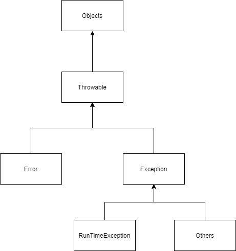
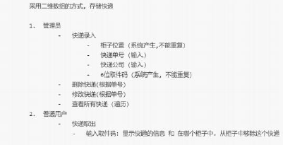

# 一、什么是异常

异常是程序中的一些错误，但并不是所有的错误都是异常，并且错误有时候是可以避免的。

比如说，你的代码少了一个分号，那么运行出来结果是提示是错误 java.lang.Error；如果你用System.out.println(11/0)，那么你是因为你用0做了除数，会抛出 java.lang.ArithmeticException 的异常。

异常发生的原因有很多，通常包含以下几大类：

* 用户输入了非法数据。
* 要打开的文件不存在。
* 网络通信时连接中断，或者JVM内存溢出。

这些异常有的是因为用户错误引起，有的是程序错误引起的，还有其它一些是因为物理错误引起的。

要理解Java异常处理是如何工作的，你需要掌握以下三种类型的异常：

* **检查性异常**：最具代表的检查性异常是用户错误或问题引起的异常，这是程序员无法预见的。例如要打开一个不存在文件时，一个异常就发生了，这些异常在编译时不能被简单地忽略。
* **运行时异常**： 运行时异常是可能被程序员避免的异常。与检查性异常相反，运行时异常可以在编译时被忽略。
* **错误**： 错误不是异常，而是脱离程序员控制的问题。错误在代码中通常被忽略。例如，当栈溢出时，一个错误就发生了，它们在编译也检查不到的。

# 二、异常体系结构



所有异常都是继承于Throwable的，其中有Error和Exception。

Error是编译时错误和系统错误，系统错误在除特殊情况下，都不需要你来关心，基本不会出现。
而编译时错误，如果你使用了编译器，那么编译器会提示。

Exception则是可以被抛出的基本类型，我们需要主要关心的也是这个类。

1. 其他Exception，受检查异常。
   可以理解为错误，必须要开发者解决以后才能编译通过，
   解决的方法有两种，1：throw到上层，2，try-catch处理。
2. RunTimeException：运行时异常，又称不受检查异常。
   因为不受检查，所以在代码中可能会有RunTimeException时Java编译检查时不会告诉你有这个异常，
   但是在实际运行代码时则会暴露出来，比如经典的1/0，空指针等。
   如果不处理也会被Java自己处理。
   

# 三、处理异常

## 3.1 try-catch

使用 try 和 catch 关键字可以捕获异常。try/catch 代码块放在异常可能发生的地方。

try/catch代码块中的代码称为保护代码，使用 try/catch 的语法如下：

```java
try
{
   // 程序代码
}catch(ExceptionName e1)
{
   // Catch 块
}
```
Catch 语句包含要捕获异常类型的声明。当保护代码块中发生一个异常时，try 后面的 catch 块就会被检查。

如果发生的异常包含在 catch 块中，异常会被传递到该 catch 块，这和传递一个参数到方法是一样。

实际上，就是先预料所遇到的异常，在进行处理。

### 3.1.1 finally

在网络编程、数据库操作，都可能会发生异常、释放内存。放在finally中，因为finally必然会执行。

### 3.1.2 [案例](../04-try-catch-finall/src/sample/java/ReturnWithFinally.java)

在视频中讲到一个案例。比较经典也是我之前没注意过的。

就是final对引用类型和非引用类型内容改变是不是会影响try语句块中return的结果。

## 3.2 throws

### 3.2.1 抛出异常

如果一个方法没有捕获到一个检查性异常，那么该方法必须使用 throws 关键字来声明。throws 关键字放在方法签名的尾部。

也可以使用 throw 关键字抛出一个异常，无论它是新实例化的还是刚捕获到的。

下面方法的声明抛出一个 RemoteException 异常：

```java
import java.io.*;
public class className
{
  public void deposit(double amount) throws RemoteException
  {
    // Method implementation
    throw new RemoteException();
  }
  //Remainder of class definition
}
```

视频里的代码真是笑死我了。
```java
throw new Exception("抛着玩的。");
```

一个方法可以声明抛出多个异常，多个异常之间用逗号隔开。

例如，下面的方法声明抛出 RemoteException 和 InsufficientFundsException：
```java
import java.io.*;
public class className
{
   public void withdraw(double amount) throws RemoteException,
                              InsufficientFundsException
   {
       // Method implementation
   }
   //Remainder of class definition
}
```

### 3.2.2 [案例](../05-throws/src/sample/java/ThrowsSample.java)

抛出异常的时机及简单应用。

## 3.3 自定义异常

仅作了解。

在 Java 中你可以自定义异常。编写自己的异常类时需要记住下面的几点。
1. 所有异常都必须是 Throwable 的子类。
2. 如果希望写一个检查性异常类，则需要继承 Exception 类。
3. 如果你想写一个运行时异常类，那么需要继承 RuntimeException 类。

# 四、作业

本节任务用于熟悉快递管理业务，完成快递管理控制台项目，具体需求如图。



[思路](../06-homework/readme.md)

[代码](../06-homework/src/sample/java/Test.java)


